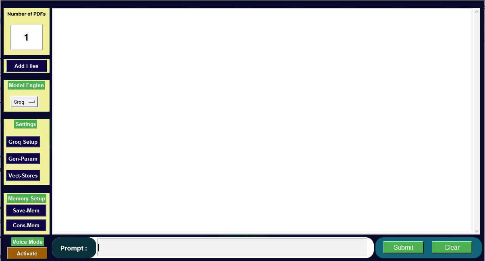

# 🚀 AI Assistant ChatBot 🧠

#### AI Assistant ChatBot is an advanced Python-based virtual assistant (RAG) that supports both voice and text interactions. It features real-time voice recognition, conversational memory, and intelligent document processing. With customizable settings and seamless integration with cutting-edge AI models like Groq and Ollama, it delivers an interactive and efficient user experience through a dynamic and visually appealing GUI.

### Features
- 🗒️ Chat with your documents (PDFs).
- 🔊 Real-time voice recognition.
- 🧠 Intelligent memory management.
- 🎨 Interactive and appealing GUI.
- 🦾 Custormizable.
- 🤖 User Friendly and Easy to use.

### **Before Use:** 
#### 01. Groq users

- Visit the Groq website and sign up or log in. [GitHub](https://console.groq.com/playground)
- Navigate to the API section and generate an API key. (Keep your API key)

#### 02. Ollama users

- Download and install the Ollama LLM Server from the Ollama website. [GitHub](https://ollama.com/)
- Follow the installation guide for your operating system.

