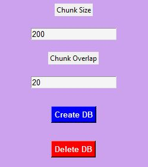
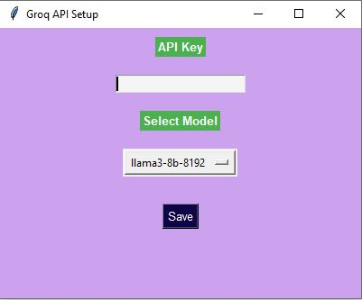
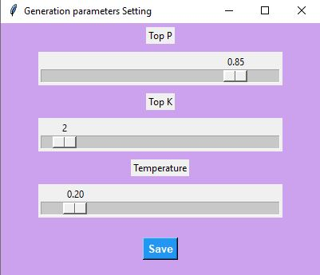
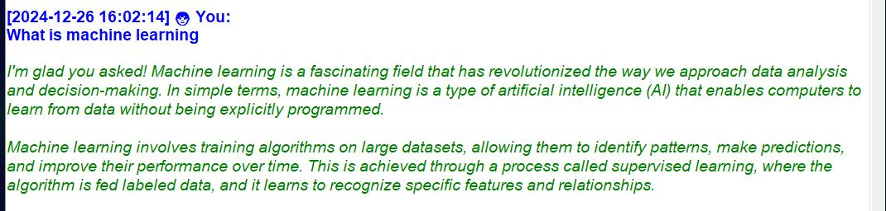
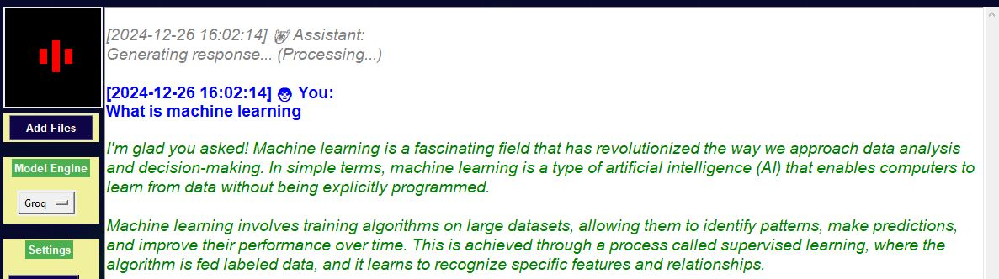

# 🚀 AI Assistant ChatBot 🧠

#### AI Assistant ChatBot is an advanced Python-based virtual assistant (RAG) that supports both voice and text interactions. It features real-time voice recognition, conversational memory, and intelligent document processing. With customizable settings and seamless integration with cutting-edge AI models like Groq and Ollama, it delivers an interactive and efficient user experience through a dynamic and visually appealing GUI.

### Features
- 🗒️ Chat with your documents (PDFs).
- 🔊 Real-time voice recognition.
- 💾 Intelligent memory management.
- 🧠 Contextual Understanding.
- 🎨 Interactive and appealing GUI.
- ⚙️ Customizable Parameters.
- 🌐 Model Integration (Supports APIs for Groq and Ollama, offering access to advanced AI language models for response generation.).
- 🔒 Secure API Management
- 🤖 User Friendly and Easy to use.

### Applications
- 🤖 Personal assistant for day-to-day tasks.
- 📄 Document-based query resolution and management.
- 🎓 Research assistant for educational or professional purposes.
- 🗂️ Contextual memory retrieval for team collaborations.
- 🛠️ Problem Solvings.

### **Before Use:** 
#### 01. Groq users

- Visit the Groq website and sign up or log in. [Groq Website](https://console.groq.com/playground)
- Navigate to the API section and generate an API key. (Keep your API key)

#### 02. Ollama users

- Download and install the Ollama LLM Server from the Ollama website. [Ollama Website](https://ollama.com/)
- Follow the installation guide for your operating system.

## **How to Use:** 

### **01. Installation**
- Download "AI_Assistant_ChatBot" Zip file. For download, click here >>> [Zip file]([https://example.com](https://drive.google.com/file/d/1QdW0_gdIq96w0DzlU93kwQCBiEG6yUOU/view?usp=sharing))
- Extract downloaded file into your local computer drive C: (Drive C)

- Open AI_Assistant_ChatBot folder and Double Click on "ChatBot" shortcut.

NOTE: you can copy it and past anywhere!

### **02. Register**
- Click on "Register" button on Login page.

- It will open "Registration" page as below:

- All text fields are required.

-  #### Auth_Key: abghjAjhshdygsg14547764sa5sdd4

- Finally! Press "Register" button.

### **03. Login**
- Login with your created account.

Example:

- After succsessfully login, it will navigate to main ChatBot UI.

### **04. Create DB**
#### **(i) Upload Files**
- Click on "Add Files" Button and select your documents.

##### Note: Currently Support, only for PDF files.

- Click on "Save" button and it will save your PDFs in "doc" folder.

#### **(ii) Create DB**

- Click "Vect-Stores" button and it will open new window.
- Choose Chunk size and Chunk overlap settings.
- Then click "Create DB" button.

##### Note: If you already have a vector-db, you need to delete existing db and make new one.

### **05. Model Engine (selection)**
#### Currently this application support for both Ollama and Groq.

- You can select Ollama or Groq.
- If you wish to use Ollama, please refer Ollama installation.
- Before using the Groq, click on "Groq Setup" Button.
- Paste you Groq API key into textbox.

- Then click "Save" button and select "Groq" from model engine dropdown menu.

### **06. Parameter setup**

- Click on "Gen-Param" button.
- You can change Temperature, Top-p and Top-k.
- Click "Save" button.

### **07. Change Role**

- You can change Role of the bot.
- For do this open your "AI_Assistant_ChatBot" folder.
- Find "system_prompt.txt" file and change it.
- Save system_prompt.txt file.

### **08. Chat**

- Implemented with both text and voice inputs.

#### Text input field

- Click "Submit" button to pass the input prompt.
- Use "Clear" button to clear the chat display.

##### Chat Display

#### Voice Mode

- Click "Activate" button under the Voice Mode.
- For Deactivate it, Click again.

### Technologies Used

- Python
- Tkinter
- Groq API
- Ollama LLM
- LangChain
- PyPDF2
- HuggingFace Embeddings
- Sentence Transformers
- SpeechRecognition & pyttsx3
- NumPy & SciKit-Learn
-  ... ect

### Acknowledgments

I would like to extend my gratitude to the following platforms and tools that made this project possible:
- Groq: For providing cutting-edge APIs and state-of-the-art language models.
- Ollama: For delivering robust and flexible AI models that enhance local processing.
- LangChain Community: For their powerful tools and frameworks to build AI applications.
- Python Community: For the open-source libraries that make development efficient and powerful.

