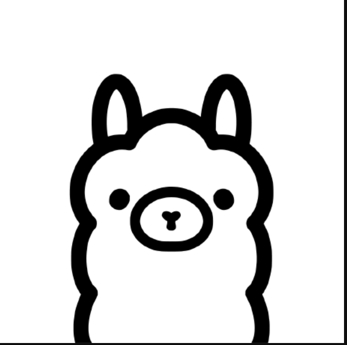

# 🚀 AI Assistant ChatBot 🧠

#### AI Assistant ChatBot is an advanced Python-based virtual assistant (RAG) that supports both voice and text interactions. It features real-time voice recognition, conversational memory, and intelligent document processing. With customizable settings and seamless integration with cutting-edge AI models like Groq and Ollama, it delivers an interactive and efficient user experience through a dynamic and visually appealing GUI.

### Features
- 🗒️ Chat with your documents (PDFs).
- 🔊 Real-time voice recognition.
- 🧠 Intelligent memory management.
- 🎨 Interactive and appealing GUI.
- 🦾 Custormizable.
- 🤖 User Friendly and Easy to use.

### **Before Use:** 
#### 01. Groq users

- Visit the Groq website and sign up or log in. [Groq Website](https://console.groq.com/playground)
- Navigate to the API section and generate an API key. (Keep your API key)

#### 02. Ollama users

- Download and install the Ollama LLM Server from the Ollama website. [Ollama Website](https://ollama.com/)
- Follow the installation guide for your operating system.

## **How to Use:** 

### **Installation**
- Download "AI_Assistant_ChatBot" Zip file from this repository.
- Extract downloaded file into your local computer drive C: (Drive C)

- Open AI_Assistant_ChatBot folder and Double Click on "ChatBot" shortcut.

NOTE: you can copy it and past anywhere!

### **Register**
- Click on "Register" button on Login page.

- It will open "Registration" page as below:

- All text fields are required.

-  #### Auth_Key: abghjAjhshdygsg14547764sa5sdd4

- Finally! Press "Register" button.

### **Login**
- Login with your created account.

Example:

- After succsessfully login, it will navigate to main ChatBot UI.

### **Create DB**
#### **Upload Files**
- Click on Add files
